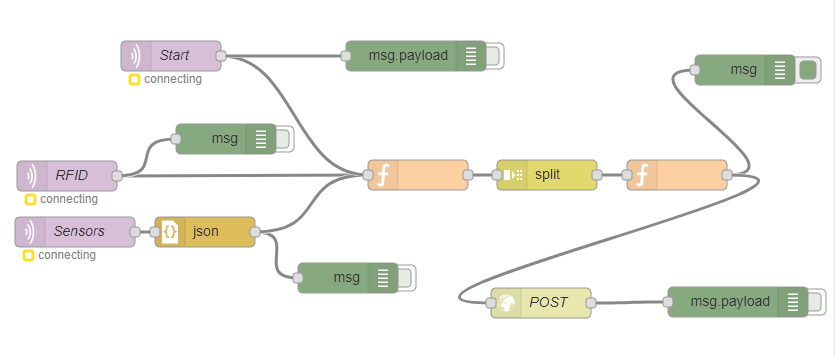
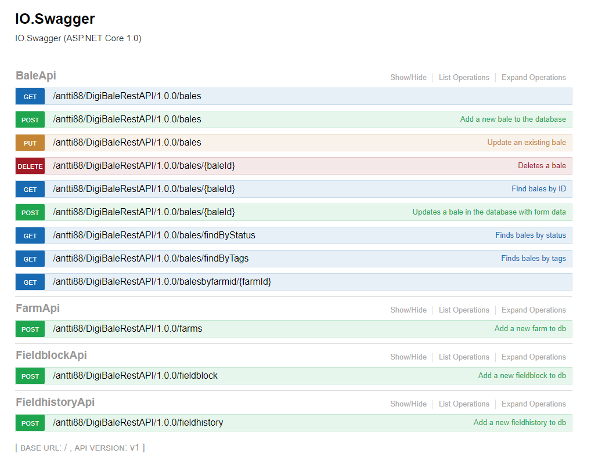

# Digipaali – Tehokkuutta rehupaalien elinkaaren hallintaan.

* ## Overviews
  Digitalization has not previously been applied in any hay bale marking and information handling. Normally, groups of bales are distinguished using different colour plastic covers, and sprays. This manual process is, without a doubt, time-consuming and inefficient. In addition to that, bales storage and trading are problems farmers have to deal with. Digipaali (Digibale) project take the advantages of information technology in general, Internet of Things (IoT) in particular, to reduce the unnecessary hard work and improve process performance. Standing in the heart of the project is Radio Frequency Identification (RFID), of which tags will be attached to bales. Users can then read bale data, e.g. temperature, humidity, GPS-data via smartphone with special readers, and make transaction on an open e-marketplace. The main point of the project lays on the stage where RFID tags are attached, and information is collected. This is done using designed box containing RFID readers, sensors, Arduino, Raspberry Pi, 4G modem, and power inverter.

* ## Hardware requirements
  In terms of power source, the connectivity for the box to function is 12 VDC from tractor socket. Therefore, an inverter is used to convert it to 220VAC and supply electricity for other components. Internet connection-wise, each box has a 4G device, which allows boards to communicate with each other, Raspberry Pi to post bales information to database.

  NordicID product Sampo S2 One-Series, as the RFID reader, provides powerful reading performance with multiple connectivity options. What makes this fixed UHF reader stand out from RFID devices of other companies is the way NordicID support their customers. In addition to human-friendly documentations on guidance, safety and regulation, drivers, firmware, they develop a user interface where you can find all information you might want to know about your running reader, from real-time system information, log files, hardware management to networking, system service, applications, etc.

  

  At the moment, two sensors are being used, giving data of three quantities including bales temperature, humidity, and location. Sparkfun Qwiic GPS Titan X1 is a GPS sensor that gives not only highly accurate GPS data but also other data under NMEA standard. Telaire Amphenol Advanced Sensors T9602 are fully calibrated and temperature compensated sensor of which resolutions are ±2% RH and ±0.3°C. These sensors are waterproof and can work well under harsh environment due to hay bale features. 

  

  

  Arduino Wemos D1 R2 Mini acquires data from sensors through I2C then publishes to Message Queuing Telemetry Transport (MQTT) broker hosted by Raspberry Pi. This is possible because the board has on it ESP8266 module, which connects to Wi-Fi network and makes simple TCP/IP connections.

  

  Besides hosting MQTT broker, Raspberry Pi runs NodeRed which handles all messages published from Arduino and RFID reader, passes data to corresponding bales, and posts to database using HTTP requests. This will be explained more clearly later. 

  

* ## Technical solutions

  ### Algorithm and procedure

  Each RFID tag has four memory banks: Reserved, Tag Identification (TID), Electronic Product Code (EPC), and User memory.  All data is stored in these banks housed by chipsets, which have same basic principles. 

  Bank 0: Reserved memory holds kill and access password of a tag. These passwords allow tags to be silenced or in secured state. Their default value is 0, at which operations will not be executed.

  Bank 1: EPC memory gives the object it attached on a unique identification all over the world, regardless of time. Its length varies 96 bits to 496 bits.

  Bank 2: TID memory identifies the tag uniqueness itself, with 32 to 80 bits. This means an object with several RFID tags on it can have same EPC memory, but not identical TID memory.

  Bank 3: User memory is where all other optional information is placed, such as temperature, date, manufacturer, etc. It sizes from 512 bits to 8K. 

  

  After tags are read by reader and environment data is measured by sensors, they will be published to MQTT broker, to which NodeRed nodes subscribe. Data handling is done by nodes also. The main idea is that, after every tags on bale are read, all of them will be attached with the same new ID and other data. Due to that, later on, when farmer scans tags, all tags on the same ball will have exact identical information, avoiding confusion. The last stage is that this data will be added to database through HTTP POST request.

  

  It is possible for the NodeRed flow on Raspberry Pi to communicate with the server is because of an Application Programming Interface (API) developed by project worker using Swagger. It is an open source software framework that allows user to design their own Representational (REST) APIs. Not only **POST** request to add new tag data to database, but our designed API is also capable of **DELETE**, **UPDATE**, **FIND**, **GET** data of desired tags from server, which will be realized in web service and smart phone application on later stage of the project.  

  

  ### Communication
  The communication protocol between devices is MQTT which is superior to other options because of its light-weightness, effectiveness and popularity. Advanced Message Queuing Protocol (AMQP) is simply a robust and large-scale of MQTT, which makes its reliability and interoperability redundant because each tag wrap process only requires four to five messages. Meanwhile, Streaming Text Oriented Messaging Protocol (STOMP) does not deal with topics but destination strings, with which brokers have to deal internally and leads to difficulty when porting code between brokers. Whereas, Constrained Appplication Protocol (CoAP), despite being more secured and having longer transmit cycle, allows only four types of messages (this of MQTT is 16), is less reliable, and sophisticated. With these being said, it is clear that MQTT is the most prime choice of all.